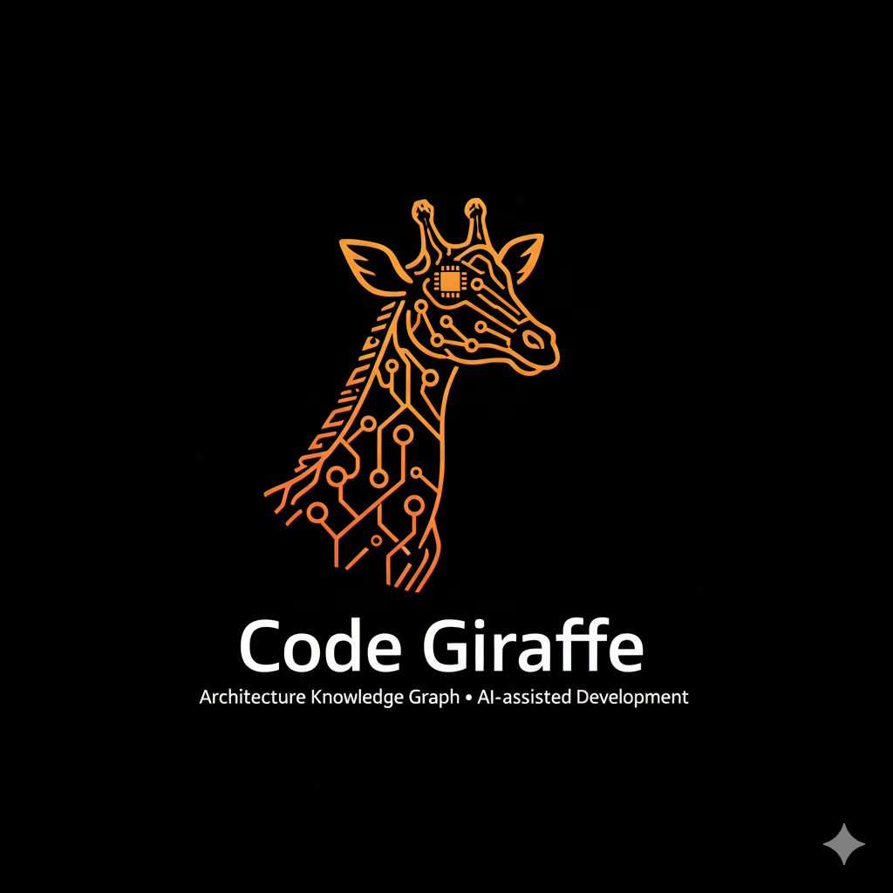

<p align="center">
  
</p>
<h1 align="center">Code Giraffe</h1>
<p align="center"><strong>Architecture knowledge graph MCP server for AI-assisted development.</strong></p>

Code Giraffe captures the relationships that static code analysis can't see -- runtime coupling, data flows, cross-system contracts, and operational context -- and exposes them as an MCP (Model Context Protocol) server that AI agents can query directly.

## Why Code Giraffe?

Modern AI coding tools understand code structure (imports, ASTs, type systems) really well. But they're blind to the relationships that actually cause production breaks:

| What IDEs See | What Code Giraffe Sees |
|---|---|
| Import graphs, function signatures | Runtime coupling (DI, reflection, dynamic imports, plugin registries) |
| File-level dependencies | Data flow and side effects (DB reads/writes, cache invalidation, idempotency) |
| Type hierarchies | Cross-system contracts (API endpoints <-> frontend components, event schemas) |
| Syntax trees | Operational context (env vars, secrets, permissions, feature flags, ownership) |

Code Giraffe fills this gap by maintaining an **architecture knowledge graph** that AI agents can query before making changes, ensuring they understand the full impact of their work.

## Quick Start

```bash
git clone https://github.com/jthom233/CodeGiraffe.git
cd CodeGiraffe
uv venv .venv && source .venv/bin/activate
uv pip install -e ".[dev]"
```

Add to Claude Code:

```bash
claude mcp add codegiraffe -- /path/to/CodeGiraffe/.venv/bin/python /path/to/CodeGiraffe/src/codegiraffe/server.py
```

See [Getting Started](docs/getting-started.md) for Claude Desktop setup, optional dependencies (embeddings, Neo4j, AST scanning), and a first-scan walkthrough.

## MCP Tools (37)

| Category | Tools | Description |
|---|---|---|
| [Core](docs/tools/core.md) | 8 | Graph init, query, manual annotation, sync, export, drift detection, dashboard |
| [Context & Analysis](docs/tools/context-and-analysis.md) | 6 | Intelligent context retrieval, hotspots, patterns, blast radius, risk, cycles |
| [Contracts](docs/tools/contracts.md) | 3 | Cross-system contract modeling and validation |
| [Change Impact](docs/tools/change-impact.md) | 5 | Change validation, test suggestions, file coupling, PR diffing, coverage |
| [Coordination](docs/tools/coordination.md) | 3 | Multi-agent claim/status coordination |
| [Versioning](docs/tools/versioning.md) | 4 | Schema evolution, history, snapshots, restore |
| [Federation](docs/tools/federation.md) | 4 | Cross-repo federation, namespaced queries, Cypher |
| [Planning](docs/tools/planning.md) | 4 | Annotation, domains, task ordering, migration planning |

See the [full tool reference](docs/tools/README.md) for parameter tables and examples.

## Key Capabilities

- **[9-Language Scanner](docs/scanner.md)** — Regex + optional tree-sitter AST scanning for Python, TypeScript, Go, Rust, Java, C/C++, C#, PHP, Ruby
- **[Edge Confidence Scoring](docs/edge-confidence.md)** — All edges carry confidence values (0.0–1.0) based on detection method
- **[3 Storage Backends](docs/storage.md)** — JSON (default), SQLite, Neo4j with transparent StorageBackend protocol
- **[Embedding-Based Scoring](docs/embeddings.md)** — Optional semantic similarity for smarter context retrieval
- **[Web Dashboard](docs/dashboard.md)** — Interactive Sigma.js v3 graph visualization with search, filtering, and PNG export
- **[Cross-System Contracts](docs/tools/contracts.md)** — API, event, config, and data contract modeling with validation
- **[Usage Patterns](docs/usage-patterns.md)** — Orchestrator workflows, impact analysis, change validation, multi-agent coordination

## Architecture

Code Giraffe is built on FastMCP + NetworkX with Pydantic v2 data models. The codebase follows a modular design with pluggable storage backends, a registry-based scanner system, and optional embedding support.

See [Architecture](docs/architecture.md) for the full module layout, data model, and type reference.

## Development

```bash
uv pip install -e ".[dev]"
python -m pytest tests/ -v
```

1452+ tests covering all subsystems. See [Roadmap](docs/roadmap.md) for version history (v0.2.0–v0.14.0).

## License

MIT

## Contributing

Contributions welcome. Please follow the [project constitution](docs/architecture.md) and ensure all tests pass before submitting PRs.
